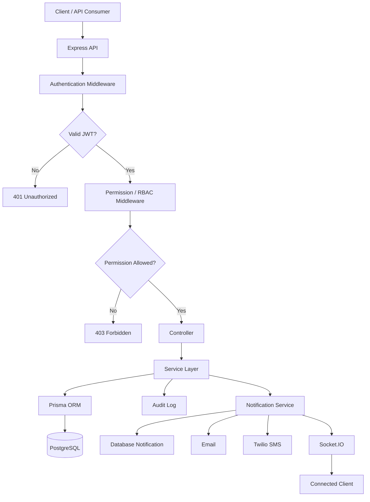
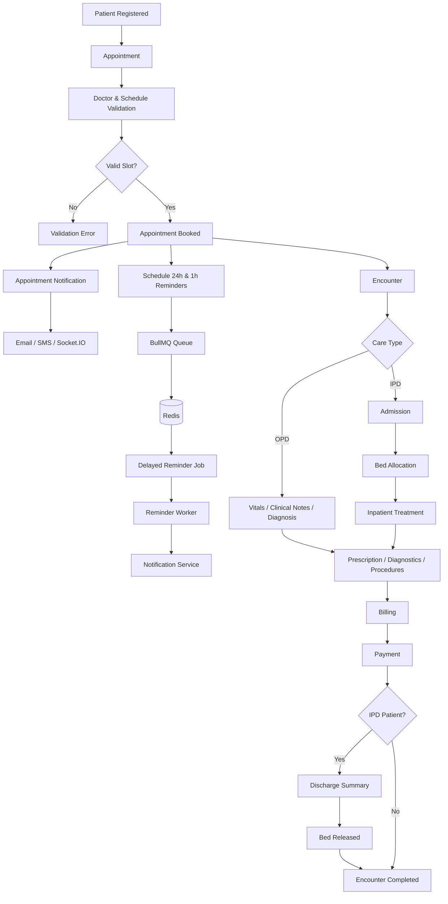
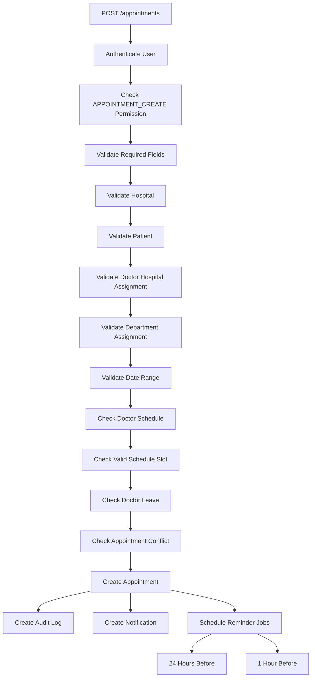
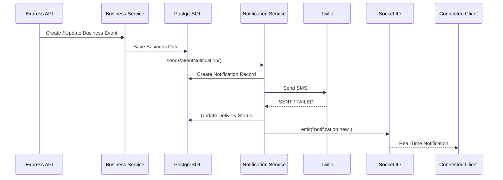
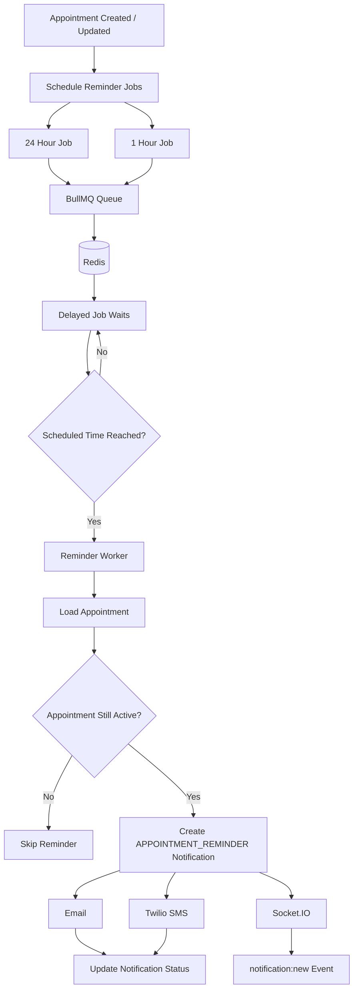
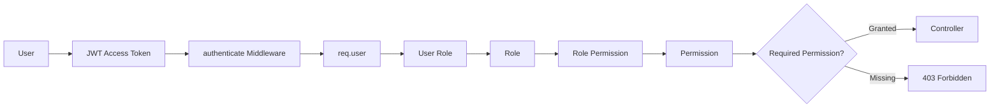

# MedCore Hospital Management Platform

A secure, modular, and scalable **Hospital Management System backend**
built with Node.js, Express, TypeScript, Prisma, PostgreSQL, JWT/RBAC,
Socket.IO, Redis, BullMQ, Twilio, and Docker.

**Repository:**
https://github.com/SnehashisKundu/Medcore-Hospital-Management-Platform

------------------------------------------------------------------------

## Project Overview

MedCore models connected hospital workflows rather than isolated CRUD
operations.

``` text
Patient
  ↓
Appointment
  ↓
Encounter
  ↓
OPD or IPD Care
```

### OPD Workflow

``` text
Appointment
  ↓
OPD Encounter
  ↓
Vitals → Clinical Notes → Diagnosis
  ↓
Prescription / Diagnostics / Procedures
  ↓
Billing → Payment
```

### IPD Workflow

``` text
IPD Appointment
  ↓
Encounter
  ↓
Admission
  ↓
Bed Allocation
  ↓
Inpatient Treatment
  ↓
Billing / Payment
  ↓
Discharge Summary
  ↓
Bed Released → Admission Discharged → Encounter Completed
```

------------------------------------------------------------------------

## Key Features

-   JWT authentication with access and refresh tokens
-   Register, login, logout, current user, password change and password
    reset
-   Role-Based Access Control with roles and permissions
-   Audit logging
-   Hospital and department management
-   Doctor hospital and department assignments
-   Doctor schedules, availability and leave validation
-   Patient management
-   Appointment management and conflict prevention
-   Encounters, vitals, clinical notes and diagnoses
-   OPD and IPD workflows
-   Admissions and discharge summaries
-   Ward, room, bed and bed allocation management
-   Medicine, stock, prescriptions and medicine dispensing
-   Diagnostic tests, orders, lab results and imaging reports
-   Procedures, procedure orders and staff assignment
-   Billing and payments
-   Hospital location and availability support
-   Database-backed notifications
-   Email notifications
-   Twilio SMS notifications
-   Socket.IO real-time notifications
-   Notification delivery status tracking
-   Redis background infrastructure
-   BullMQ delayed appointment reminders
-   Appointment reminders at 24 hours and 1 hour before appointments

------------------------------------------------------------------------

## Technology Stack

  Technology   Purpose
  ------------ -----------------------------------
  Node.js      Backend runtime
  Express.js   HTTP API framework
  TypeScript   Type-safe development
  PostgreSQL   Relational database
  Prisma ORM   Typed database access
  JWT          Authentication and authorization
  Socket.IO    Real-time notification events
  Redis        Background job infrastructure
  BullMQ       Delayed appointment reminder jobs
  Nodemailer   Email notifications
  Twilio       SMS notifications
  Docker       Development infrastructure
  Postman      API testing

------------------------------------------------------------------------


## Project Flowcharts

The diagrams below provide a visual view of how the major parts of MedCore work together.

### 1. Complete System Flow



### 2. Core Hospital Patient Journey



### 3. Appointment Creation and Validation Flow



### 4. Real-Time Notification Flow



### 5. BullMQ Appointment Reminder Flow



### 6. RBAC Authorization Flow




## System Architecture

``` text
Client / API Consumer
        ↓
   Express Routes
        ↓
Authentication Middleware
        ↓
Authorization / RBAC
        ↓
    Controller
        ↓
   Service Layer
        ↓
    Prisma ORM
        ↓
    PostgreSQL

Important events
        ↓
Audit Log / Notification Service
        ├── Email
        ├── Twilio SMS
        └── Socket.IO

Appointment reminders
        ↓
BullMQ Queue
        ↓
Redis
        ↓
Delayed Job
        ↓
Reminder Worker
        ↓
Notification Service
```

------------------------------------------------------------------------

## Project Structure

``` text
apps/api/src
│
├── app.ts
├── server.ts
│
├── config
│   ├── prisma.ts
│   ├── redis.ts
│   └── socket.ts
│
├── middleware
│   └── permission.middleware.ts
│
└── modules
    ├── appointment
    ├── appointment-reminder
    │   ├── reminder.queue.ts
    │   └── reminder.worker.ts
    ├── audit-log
    ├── auth
    ├── notification
    ├── patient
    ├── doctor
    ├── hospital
    ├── department
    ├── encounter
    ├── admission
    ├── discharge-summary
    ├── ward
    ├── room
    ├── bed
    ├── bed-allocation
    ├── medicine
    ├── medicine-stock
    ├── prescription
    ├── medicine-dispense
    ├── diagnostictest
    ├── diagnostic-order
    ├── lab-result
    ├── imaging-report
    ├── procedure
    ├── procedure-order
    ├── procedure-staff-assignment
    ├── billing
    ├── payment
    ├── role
    ├── permission
    └── user-role
```

Most modules follow:

``` text
module/
├── <module>.service.ts
├── <module>.controller.ts
└── <module>.routes.ts
```

------------------------------------------------------------------------

## Authentication and RBAC

Protected requests use:

``` text
Authorization: Bearer <accessToken>
```

Authorization hierarchy:

``` text
User
  ↓
User Role
  ↓
Role
  ↓
Role Permission
  ↓
Permission
```

Authentication determines **who the user is**.\
Authorization determines **what the user can do**.

------------------------------------------------------------------------

## Notifications and Real-Time Events

Notification delivery statuses:

``` text
PENDING
SENT
FAILED
SKIPPED
```

Flow:

``` text
Business Event
      ↓
Notification Service
      ↓
Create Notification Record
      ├── Email → SENT / FAILED
      ├── Twilio SMS → SENT / FAILED
      └── Socket.IO
              ↓
      notification:new
              ↓
      Connected Client
```

### Twilio SMS

The project uses:

``` text
TWILIO_ACCOUNT_SID
TWILIO_AUTH_TOKEN
TWILIO_PHONE_NUMBER
```

Real Twilio SMS delivery was successfully tested.

### Socket.IO

Socket.IO runs on the same HTTP server as the Express API.

Current event:

``` text
notification:new
```

A Socket.IO client successfully received real-time notification events
during testing.

------------------------------------------------------------------------

## Appointment Reminders

Appointment reminders use Redis and BullMQ.

Reminders are scheduled for:

``` text
24 hours before the appointment
1 hour before the appointment
```

Flow:

``` text
Appointment Created
        ↓
Schedule Reminder Jobs
        ├── 24_HOURS
        └── 1_HOUR
        ↓
BullMQ Queue
        ↓
Redis
        ↓
Delayed Job
        ↓
Reminder Worker
        ↓
APPOINTMENT_REMINDER
        ↓
Notification Service
        ├── Email
        ├── SMS
        └── Socket.IO
```

Reminder jobs use deterministic IDs based on:

``` text
appointmentId-reminderType
```

This supports targeted lookup and cancellation.

------------------------------------------------------------------------

## Database and Prisma

Useful commands:

### Generate Prisma Client

``` bash
npx prisma generate
```

### Create and Apply Migration

``` bash
npx prisma migrate dev
```

### Validate Schema

``` bash
npx prisma validate
```

### Open Prisma Studio

``` bash
npx prisma studio
```

------------------------------------------------------------------------

## Getting Started

### Prerequisites

-   Node.js
-   npm
-   Docker
-   Git

### Clone

``` bash
git clone https://github.com/SnehashisKundu/Medcore-Hospital-Management-Platform.git
cd Medcore-Hospital-Management-Platform
```

### Install Dependencies

``` bash
cd apps/api
npm install
```

### Start Infrastructure

``` bash
docker compose up -d
```

### Run Prisma Migration

``` bash
npx prisma migrate dev
```

### Generate Prisma Client

``` bash
npx prisma generate
```

### Start the API

``` bash
npm run dev
```

Socket.IO runs on the same HTTP server.

------------------------------------------------------------------------

## Environment Variables

Create an `.env` file:

``` env
PORT=3000

DATABASE_URL=

JWT_SECRET=
JWT_EXPIRES_IN=

REDIS_HOST=localhost
REDIS_PORT=6379

TWILIO_ACCOUNT_SID=
TWILIO_AUTH_TOKEN=
TWILIO_PHONE_NUMBER=

EMAIL_HOST=
EMAIL_PORT=
EMAIL_USER=
EMAIL_PASSWORD=
```

Never commit real credentials, secrets, API keys, or production database
URLs.

Recommended `.gitignore`:

``` gitignore
node_modules/
.env
.env.*
dist/
coverage/
*.log
```

------------------------------------------------------------------------

## Docker

Docker provides supporting infrastructure such as PostgreSQL and Redis
when configured in `docker-compose.yml`.

``` bash
docker compose up -d
docker ps
docker compose down
```

------------------------------------------------------------------------

## Testing

Testing performed with Postman and direct integration checks:

-   Authentication and protected endpoints
-   RBAC behavior
-   CRUD operations
-   Validation and error cases
-   Doctor assignments and schedule validation
-   Appointment conflict validation
-   Admission and bed allocation lifecycle
-   Bed release and discharge lifecycle
-   Password and token flows
-   Audit logging
-   Notification creation and status tracking
-   Real Twilio SMS delivery
-   Socket.IO real-time notification delivery
-   Redis connectivity
-   BullMQ delayed reminder processing
-   Appointment reminder worker processing

### Recent Integration Results

-   [x] Twilio SMS successfully received on a real device
-   [x] Socket.IO client received `notification:new`
-   [x] BullMQ reminder jobs scheduled and processed through Redis
-   [x] Reminder worker reached the notification flow
-   [x] `APPOINTMENT_REMINDER` added to Prisma `NotificationType` and
    migrated
-   [x] 24-hour reminder scheduling implemented
-   [x] 1-hour reminder scheduling implemented

------------------------------------------------------------------------

## Implemented Modules

### Authentication and Access

-   [x] Auth
-   [x] Role
-   [x] Permission
-   [x] Role Permission
-   [x] User Role
-   [x] Audit Log

### Hospital Infrastructure

-   [x] Hospital
-   [x] Department
-   [x] Ward
-   [x] Room
-   [x] Bed
-   [x] Bed Allocation

### Doctor Management

-   [x] Doctor
-   [x] Doctor Hospital
-   [x] Doctor Department Assignment
-   [x] Specialization

### Patient and Clinical Care

-   [x] Patient
-   [x] Appointment
-   [x] Encounter
-   [x] Vitals
-   [x] Clinical Note
-   [x] Diagnosis

### IPD

-   [x] Admission
-   [x] Discharge Summary

### Pharmacy

-   [x] Medicine
-   [x] Medicine Stock
-   [x] Prescription
-   [x] Medicine Dispense

### Diagnostics

-   [x] Diagnostic Test
-   [x] Diagnostic Order
-   [x] Lab Result
-   [x] Imaging Report

### Procedures

-   [x] Procedure
-   [x] Hospital Procedure
-   [x] Procedure Order
-   [x] Procedure Staff Assignment

### Finance

-   [x] Billing
-   [x] Payment

### Notifications and Background Processing

-   [x] Database-backed Notification System
-   [x] Email Notification Integration
-   [x] Twilio SMS Integration
-   [x] Socket.IO Real-Time Notifications
-   [x] Redis Integration
-   [x] BullMQ Appointment Reminder Queue
-   [x] Appointment Reminder Worker
-   [x] 24-Hour Appointment Reminder
-   [x] 1-Hour Appointment Reminder
-   [x] `APPOINTMENT_REMINDER` Notification Type

------------------------------------------------------------------------

## Development Status

``` text
Authentication and Security          COMPLETE
RBAC                                COMPLETE
Hospital Management                 COMPLETE
Patient Management                  COMPLETE
Clinical Modules                    COMPLETE
Appointment Management              COMPLETE
IPD Workflow                        COMPLETE
Bed Management                      COMPLETE
Pharmacy                            COMPLETE
Diagnostics                         COMPLETE
Procedures                          COMPLETE
Billing and Payments                COMPLETE
Audit Logging                       COMPLETE
Location and Availability           COMPLETE

Notification System                 COMPLETE
Twilio SMS Integration              TESTED
Socket.IO Real-Time Events          TESTED
Redis Infrastructure                COMPLETE
BullMQ Reminder Queue               COMPLETE
Appointment Reminder Worker         COMPLETE
24-Hour Reminder Scheduling         COMPLETE
1-Hour Reminder Scheduling          COMPLETE

API Testing                         COMPLETED
Workflow Testing                    COMPLETED
Prisma Migration and Generate       COMPLETED
```

------------------------------------------------------------------------

## Final System Summary

``` text
AUTHENTICATION
    ↓
RBAC
    ↓
HOSPITAL CONTEXT
    ↓
PATIENT
    ↓
APPOINTMENT
    ├── Appointment Booked Notification
    │       ├── Email
    │       ├── Twilio SMS
    │       └── Socket.IO
    │
    └── Appointment Reminders
            ├── 24 Hours Before
            └── 1 Hour Before
                    ↓
                  Redis
                    ↓
                 BullMQ
                    ↓
             Reminder Worker
                    ↓
              Notification Service

APPOINTMENT
    ↓
ENCOUNTER
    ├── OPD → Clinical Care
    └── IPD → Admission → Bed Allocation → Patient Care
                    ↓
      Pharmacy / Diagnostics / Procedures
                    ↓
                  Billing
                    ↓
                  Payment
                    ↓
           Discharge / Completion
```

------------------------------------------------------------------------

**Built as part of the MedCore Hospital Management Platform project.**
