# MedCore Hospital Management Platform

A secure, modular, and scalable **Hospital Management System backend** built to manage hospital operations, patient care, clinical workflows, IPD admission/discharge, pharmacy, diagnostics, procedures, billing, payments, authentication, RBAC, audit logging, and hospital location-based availability.

**Repository:** https://github.com/SnehashisKundu/Medcore-Hospital-Management-Platform

---

## Table of Contents

1. Project Overview
2. Key Features
3. Technology Stack
4. Architecture
5. Project Structure
6. Core Modules
7. Authentication and Security
8. RBAC
9. Request Flow
10. Clinical Workflows
11. OPD Workflow
12. IPD Workflow
13. Pharmacy
14. Diagnostics
15. Procedures
16. Billing and Payments
17. Location and Availability
18. Audit Logging
19. Database and Prisma
20. Setup
21. Environment Variables
22. Docker
23. Testing
24. Development Status
25. Documentation

---

# 1. Project Overview

MedCore models the major operational and clinical workflows of a hospital. The system is not designed as isolated CRUD modules only; important entities are connected through practical workflows.

Main patient journey:

```text
Patient
  ↓
Appointment
  ↓
Encounter
  ↓
OPD or IPD Care
```

IPD journey:

```text
IPD Appointment
  ↓
Encounter
  ↓
Admission
  ↓
Bed Allocation
  ↓
Inpatient Treatment
  ↓
Billing / Payment
  ↓
Discharge Summary
  ↓
Bed Released
  ↓
Admission Discharged
  ↓
Encounter Completed
```

---

# 2. Key Features

- JWT authentication
- Access and refresh token flow
- Register, login, logout and current-user access
- Change password
- Forgot and reset password
- Secure one-time password reset tokens
- Role-Based Access Control
- Roles, permissions, user roles and role permissions
- Audit logging
- Hospital and department management
- Doctor, hospital and department assignments
- Patient management
- Appointments and encounters
- Vitals, clinical notes and diagnoses
- OPD and IPD workflows
- Admission and discharge
- Ward, room, bed and bed allocation
- Medicine and medicine stock
- Prescription and medicine dispensing
- Diagnostic tests and diagnostic orders
- Lab results and imaging reports
- Procedures and procedure orders
- Procedure staff assignment
- Billing and payments
- Hospital location support
- Nearby hospital discovery
- Bed availability checking

---

# 3. Technology Stack

| Technology | Purpose |
|---|---|
| Node.js | Backend runtime |
| Express.js | HTTP API framework |
| TypeScript | Type-safe development |
| PostgreSQL | Relational database |
| Prisma ORM | Typed database access |
| Prisma Migrate | Schema migrations |
| JWT | Authentication |
| Docker | Containerized development/infrastructure |
| Postman | API testing |

---

# 4. System Architecture

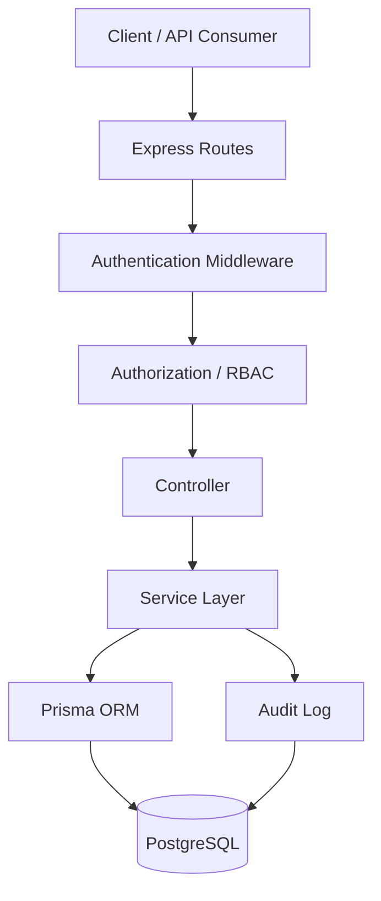

### Routes
Define endpoints and connect requests to controllers.

### Middleware
Handles shared request concerns such as authentication and authorization.

### Controllers
Handle HTTP input/output and call the service layer.

### Services
Contain business rules, workflow validation, relationship checks, database operations, and audit actions.

### Prisma
Provides typed access to PostgreSQL and manages schema-driven database operations.

---

# 5. Project Structure

```text
apps/api/src
│
├── config
├── controllers
├── generated
├── middleware
└── modules
    ├── admission
    ├── appointment
    ├── audit-log
    ├── auth
    ├── bed
    ├── bed-allocation
    ├── billing
    ├── clinical-note
    ├── department
    ├── diagnosis
    ├── diagnostic-order
    ├── diagnostictest
    ├── discharge-summary
    ├── doctor
    ├── doctorDepartmentAssignment
    ├── doctorHospital
    ├── encounter
    ├── hospital
    ├── hospital-procedure
    ├── imaging-report
    ├── lab-result
    ├── medicine
    ├── medicine-dispense
    ├── medicine-stock
    ├── patient
    ├── payment
    ├── permission
    ├── prescription
    ├── procedure
    ├── procedure-order
    ├── procedure-staff-assignment
    ├── role
    ├── role-permission
    ├── room
    ├── specialization
    ├── user-role
    ├── vitals
    └── ward
```

Most modules follow:

```text
module/
├── <module>.service.ts
├── <module>.controller.ts
└── <module>.routes.ts
```

---

# 6. Core Modules

## Authentication and Access
- Auth
- Role
- Permission
- Role Permission
- User Role
- Audit Log

## Hospital Infrastructure
- Hospital
- Department
- Ward
- Room
- Bed
- Bed Allocation

## Doctor Management
- Doctor
- Doctor Hospital
- Doctor Department Assignment
- Specialization

## Patient and Clinical Care
- Patient
- Appointment
- Encounter
- Vitals
- Clinical Note
- Diagnosis

## IPD
- Admission
- Bed Allocation
- Discharge Summary

## Pharmacy
- Medicine
- Medicine Stock
- Prescription
- Medicine Dispense

## Diagnostics
- Diagnostic Test
- Diagnostic Order
- Lab Result
- Imaging Report

## Procedures
- Procedure
- Hospital Procedure
- Procedure Order
- Procedure Staff Assignment

## Finance
- Billing
- Payment

---

# 7. Authentication and Security

The authentication module supports:

```text
Register
Login
Refresh Token
Logout
Get Current User
Change Password
Forgot Password
Reset Password
```

Protected requests use:

```text
Authorization: Bearer <accessToken>
```

Login flow:

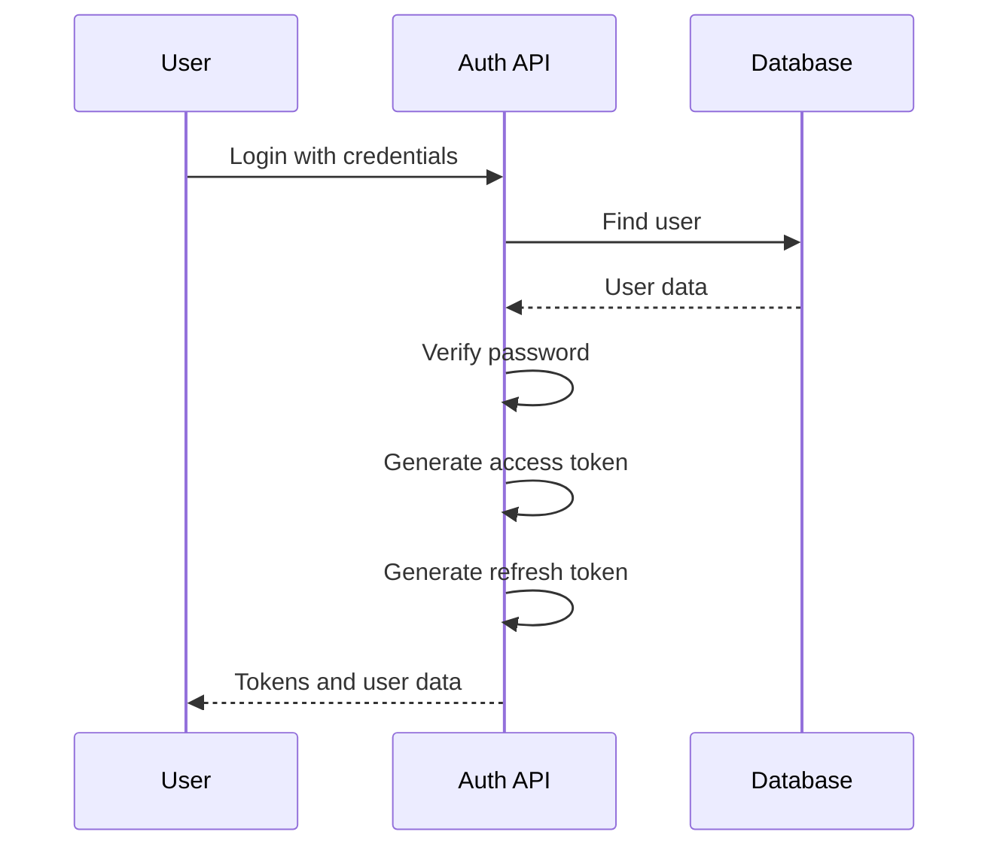

Password recovery flow:

```text
Forgot Password
    ↓
Check Active Account
    ↓
Generate Secure Reset Token
    ↓
Store Token Hash
    ↓
Reset Password Request
    ↓
Validate Token and Expiry
    ↓
Set New Password
    ↓
Revoke Existing Refresh Sessions
```

Reset tokens are designed for one-time use and are invalid after use.

---

# 8. Role-Based Access Control

Authorization is based on:

```text
User
  ↓
User Role
  ↓
Role
  ↓
Role Permission
  ↓
Permission
```

Request security flow:

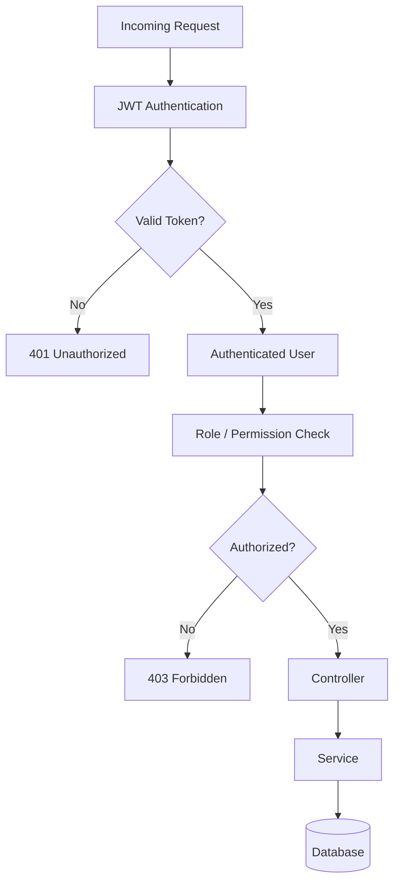

Authentication answers **who is making the request**. Authorization answers **what that user is allowed to do**.

---

# 9. Main Request Flow

```text
HTTP Request
     ↓
Express Route
     ↓
Authentication Middleware
     ↓
Authorization / RBAC
     ↓
Controller
     ↓
Service
     ↓
Prisma ORM
     ↓
PostgreSQL
     ↓
HTTP Response
```

For important mutations:

```text
Create / Update / Delete / Workflow Action
                  ↓
             Business Logic
                  ↓
           Database Mutation
                  ↓
             Audit Log
```

---

# 10. Patient and Clinical Workflow

The main patient flow:

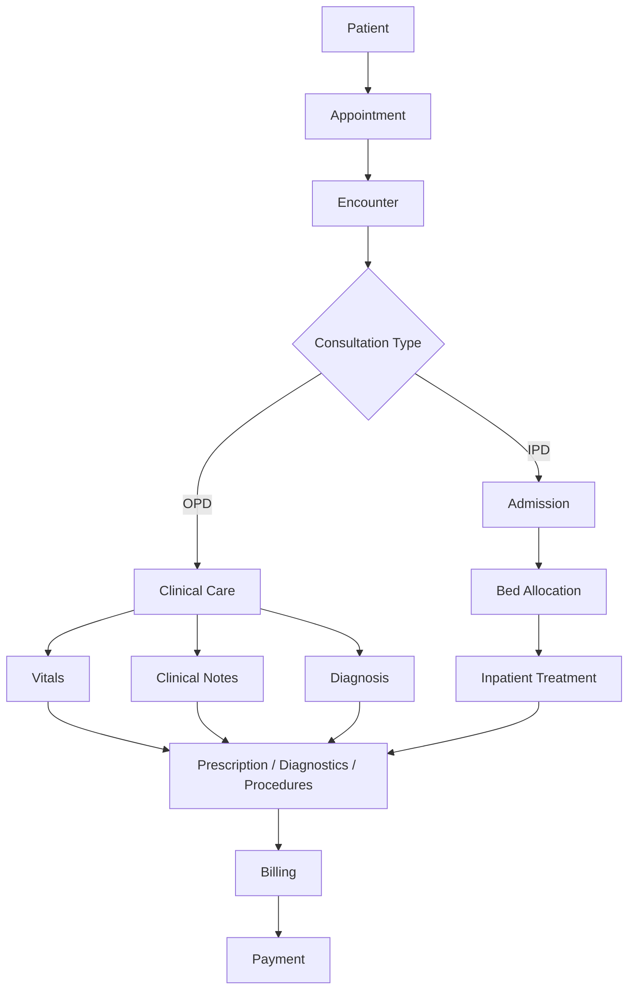

Clinical modules are centered around the encounter:

```text
Encounter
  ├── Vitals
  ├── Clinical Notes
  ├── Diagnosis
  ├── Prescription
  ├── Diagnostic Orders
  └── Procedure Orders
```

---

# 11. OPD Workflow

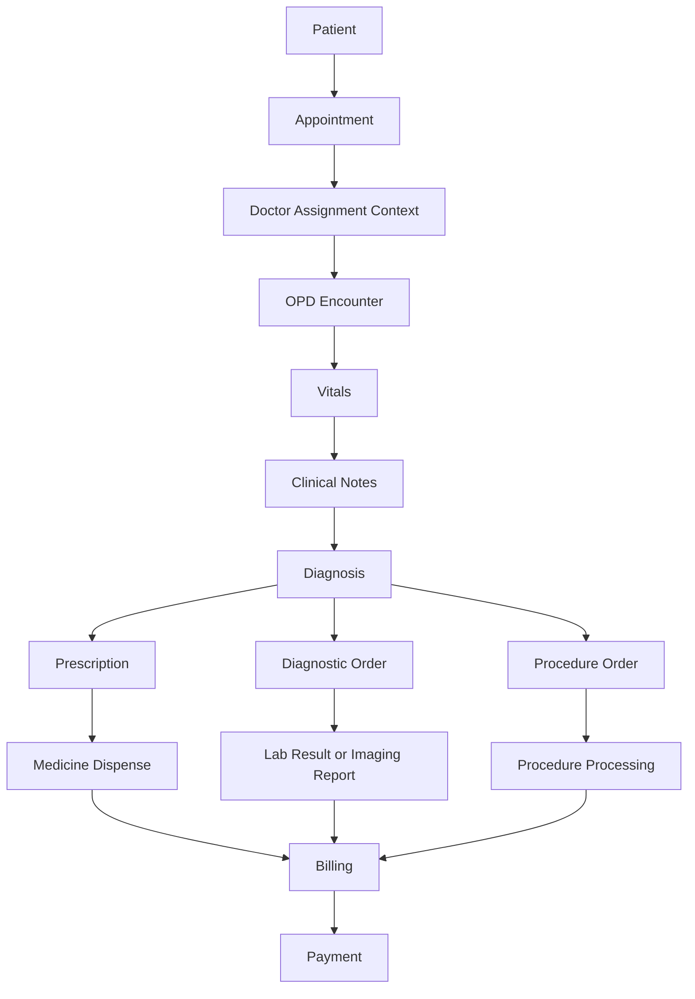

---

# 12. IPD Workflow

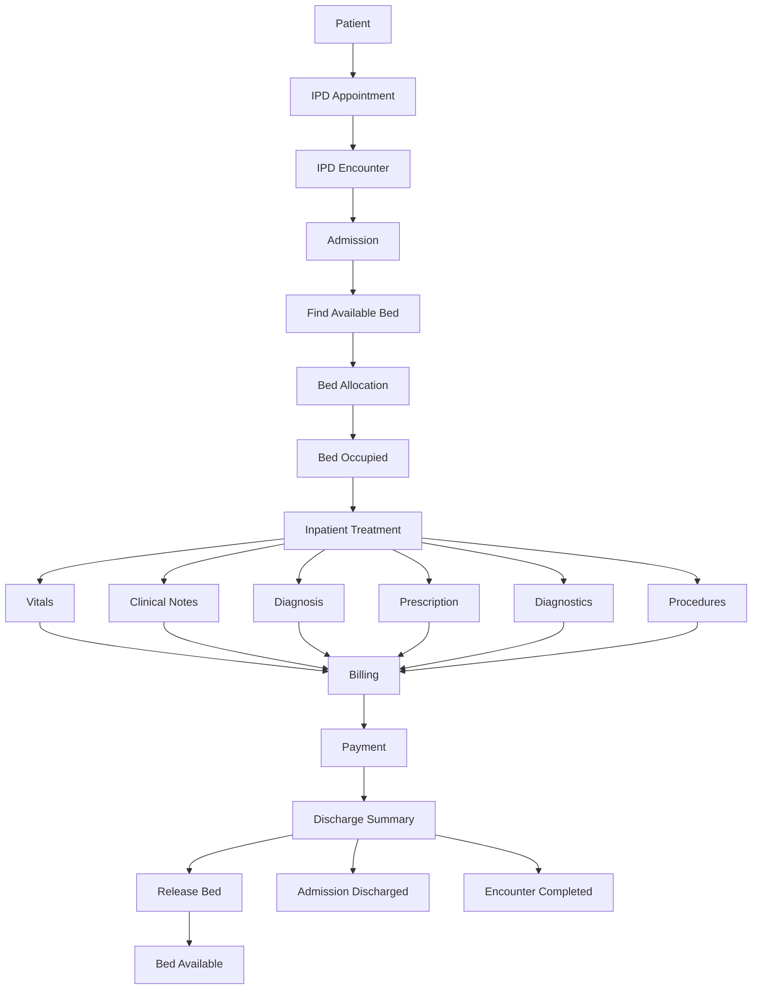

### Tested End-to-End IPD Flow

```text
Appointment
    ↓
IPD Encounter
    ↓
Admission
    ↓
Bed Allocation
    ↓
Bed Occupied
    ↓
Patient Discharge
    ↓
Bed Released / Available
    ↓
Admission Discharged
    ↓
Encounter Completed
```

---

# 13. Bed Management

Infrastructure hierarchy:

```text
Hospital
  ↓
Ward
  ↓
Room
  ↓
Bed
```

Allocation lifecycle:

```text
Active Admission
      ↓
Select Available Bed
      ↓
Create Bed Allocation
      ↓
Patient Occupies Bed
      ↓
Discharge
      ↓
Release Allocation
      ↓
Bed Available Again
```

---

# 14. Pharmacy Workflow

Modules:

- Medicine
- Medicine Stock
- Prescription
- Medicine Dispense

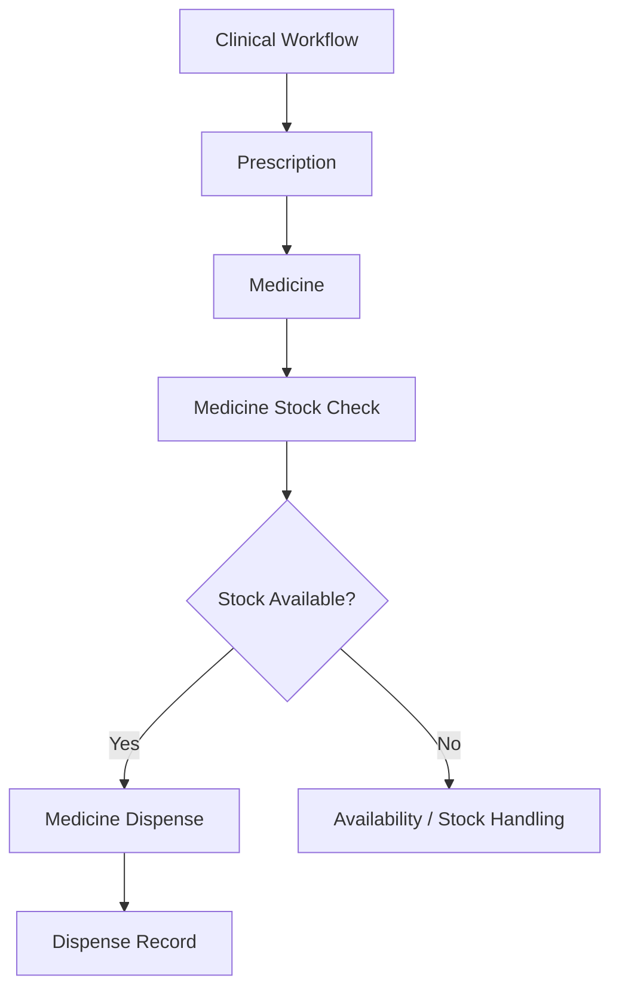

---

# 15. Diagnostics Workflow

```text
Diagnostic Test
      ↓
Diagnostic Order
      ↓
Test Processing
      ├── Lab Result
      └── Imaging Report
```

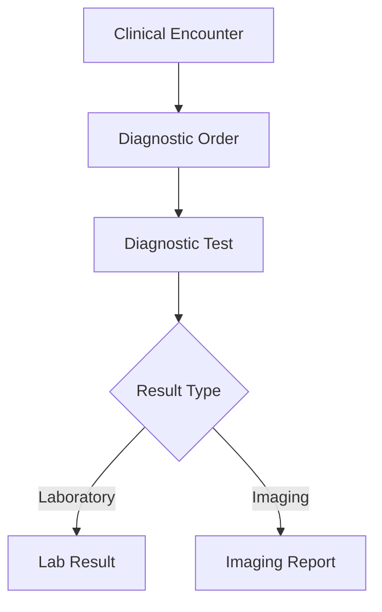

---

# 16. Procedure Workflow

```text
Procedure
    ↓
Hospital Procedure Availability
    ↓
Procedure Order
    ↓
Procedure Staff Assignment
    ↓
Procedure Processing
```

---

# 17. Billing and Payment Workflow

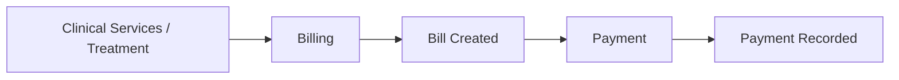

---

# 18. Hospital Location and Availability

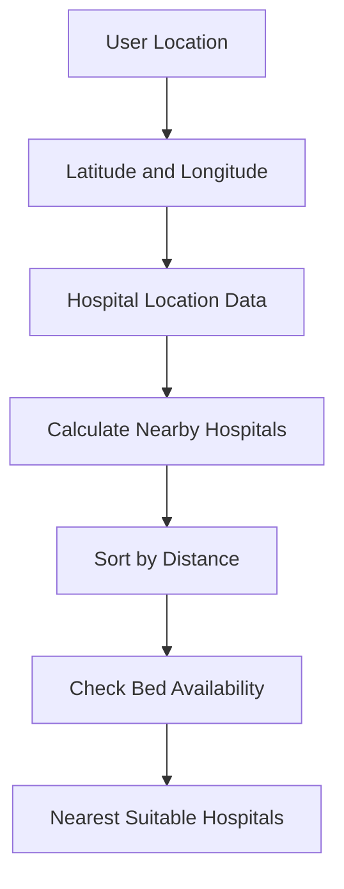

The goal is to support hospital discovery based on proximity and available capacity.

---

# 19. Audit Logging

Audit logging provides traceability for important system activity.

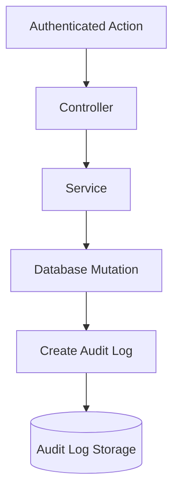

Auditable actions include important create, update, delete, and workflow state changes.

---

# 20. Database and Prisma

Data access flow:

```text
Service
   ↓
Prisma Client
   ↓
Prisma Schema
   ↓
PostgreSQL
```

Prisma is used for:

- Schema validation
- Client generation
- Migrations
- Typed database access

Useful commands:

### Generate Client

```bash
npx prisma generate
```

### Create and Apply Development Migration

```bash
npx prisma migrate dev
```

### Validate Schema

```bash
npx prisma validate
```

### Open Prisma Studio

```bash
npx prisma studio
```

---

# 21. Getting Started

## Prerequisites

Install:

- Node.js
- npm
- PostgreSQL
- Docker, if using the project's containerized setup
- Git

## Clone

```bash
git clone https://github.com/SnehashisKundu/Medcore-Hospital-Management-Platform.git
cd Medcore-Hospital-Management-Platform
```

## Install Dependencies

Run from the correct project/package directory:

```bash
npm install
```

If using the monorepo structure, run commands according to the repository's workspace configuration.

---

# 22. Environment Variables

Create the required environment file according to the project configuration.

Typical examples:

```env
DATABASE_URL=
JWT_SECRET=
JWT_EXPIRES_IN=
```

Use the exact variable names required by the existing application configuration.

Never commit:

- Real passwords
- Production credentials
- Private API keys
- Real JWT secrets
- Real database URLs containing credentials

Recommended `.gitignore` entries:

```gitignore
node_modules/
.env
.env.*
dist/
coverage/
*.log
```

---

# 23. Docker

Docker can be used for supporting infrastructure such as PostgreSQL.

```text
Docker
   ↓
PostgreSQL Container
   ↓
DATABASE_URL
   ↓
Prisma
   ↓
Express API
```

Use the repository's existing Docker configuration for exact service commands.

---

# 24. API Testing

APIs were tested using Postman during development.

Testing covered:

- Authentication
- Protected endpoints
- RBAC behavior
- CRUD operations
- Validation and error cases
- Workflow transitions
- Hospital relationships
- Doctor assignments
- Admission lifecycle
- Bed allocation
- Bed release
- Discharge lifecycle
- Password change
- Forgot password
- Reset password
- Refresh token flow
- Audit behavior

The major modules were tested individually and important connected workflows were tested end-to-end.

---

# 25. Implemented Module Checklist

## Authentication and Access
- [x] Auth
- [x] Role
- [x] Permission
- [x] Role Permission
- [x] User Role
- [x] Audit Log

## Hospital Infrastructure
- [x] Hospital
- [x] Department
- [x] Ward
- [x] Room
- [x] Bed
- [x] Bed Allocation

## Doctor Management
- [x] Doctor
- [x] Doctor Hospital
- [x] Doctor Department Assignment
- [x] Specialization

## Patient and Clinical Care
- [x] Patient
- [x] Appointment
- [x] Encounter
- [x] Vitals
- [x] Clinical Note
- [x] Diagnosis

## IPD
- [x] Admission
- [x] Discharge Summary

## Pharmacy
- [x] Medicine
- [x] Medicine Stock
- [x] Prescription
- [x] Medicine Dispense

## Diagnostics
- [x] Diagnostic Test
- [x] Diagnostic Order
- [x] Lab Result
- [x] Imaging Report

## Procedures
- [x] Procedure
- [x] Hospital Procedure
- [x] Procedure Order
- [x] Procedure Staff Assignment

## Finance
- [x] Billing
- [x] Payment

---

# 26. Documentation

The repository documentation can be organized as:

```text
README.md
Flow Chart.md
Hospital data.md
MedCore Ecosystem.txt
```

### README.md
Main entry point for developers and reviewers. Covers architecture, setup, modules, workflows, security, and testing.

### Flow Chart.md
Detailed visual system and workflow diagrams.

### Hospital data.md
Recommended for documenting entities, relationships, ownership rules, and important data dependencies.

### MedCore Ecosystem.txt
Quick high-level ecosystem view of the platform.

---

# 27. Development Status

```text
Authentication and Security      COMPLETE
RBAC                            COMPLETE
Hospital Management             COMPLETE
Patient Management              COMPLETE
Clinical Modules                COMPLETE
IPD Workflow                    COMPLETE
Bed Management                  COMPLETE
Pharmacy                        COMPLETE
Diagnostics                     COMPLETE
Procedures                      COMPLETE
Billing and Payments            COMPLETE
Audit Logging                   COMPLETE
Location and Availability       COMPLETE
API Testing                     COMPLETED
Workflow Testing                COMPLETED
Prisma Migration and Generate   COMPLETED
```

---

# Final System Summary

```text
AUTHENTICATION
    ↓
RBAC
    ↓
HOSPITAL CONTEXT
    ↓
PATIENT
    ↓
APPOINTMENT
    ↓
ENCOUNTER
    ├──────────── OPD ────────────┐
    │                             │
    │                      Clinical Care
    │                             │
    └──────────── IPD ────────────┤
                                  ↓
                              Admission
                                  ↓
                           Bed Allocation
                                  ↓
                            Patient Care
                                  ↓
             ┌────────────────────┼────────────────────┐
             ↓                    ↓                    ↓
         Pharmacy            Diagnostics          Procedures
             └────────────────────┼────────────────────┘
                                  ↓
                               Billing
                                  ↓
                               Payment
                                  ↓
                       Discharge / Completion
                                  ↓
                               Audit Log
```

---

## Built For

MedCore is designed around:

- Modularity
- Maintainability
- Security
- Traceability
- Workflow consistency
- Clear domain separation
- Scalable backend organization

---

**MedCore Hospital Management Platform**  
A modular backend for hospital operations, patient care, security, and connected clinical workflows.
