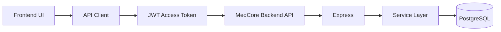
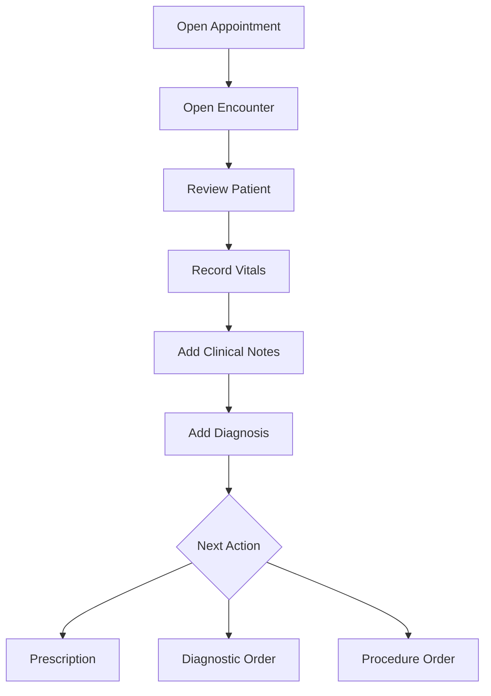
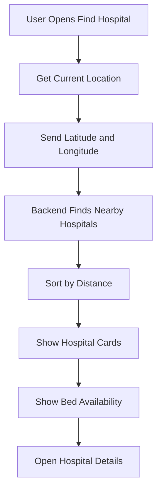

# 28. Frontend Integration Roadmap

The current backend provides the API foundation for a complete hospital management frontend. A frontend can be added incrementally around the existing modules and workflows without changing the core backend architecture.

---

## Recommended Frontend Stack

| Technology | Purpose |
|---|---|
| React / Next.js | Frontend application |
| TypeScript | Type safety |
| Tailwind CSS | UI styling |
| TanStack Query | API data fetching and caching |
| Axios / Fetch | HTTP requests |
| React Hook Form | Form handling |
| Zod | Client-side validation |
| Recharts | Dashboards and analytics |

The backend can also be consumed by Angular, Vue, React Native, Flutter, or other API clients.

---

## Frontend Architecture



Recommended structure:

```text
frontend/
├── app
│   ├── auth
│   ├── dashboard
│   ├── hospitals
│   ├── patients
│   ├── appointments
│   ├── encounters
│   ├── admissions
│   ├── beds
│   ├── pharmacy
│   ├── diagnostics
│   ├── procedures
│   ├── billing
│   └── settings
├── components
├── services
├── hooks
├── types
└── utils
```

---

## 28.1 Authentication UI

Existing auth APIs can power:

- Login
- Register
- Forgot Password
- Reset Password
- Change Password
- Profile / Current User
- Logout

Flow:

```text
Login Page
    ↓
Login API
    ↓
Access Token + Refresh Token
    ↓
Load Current User
    ↓
Role-Based Dashboard
```

The frontend API layer should:

- Attach access tokens to protected requests
- Handle expired access tokens
- Call the refresh-token API when appropriate
- Retry failed requests after refresh when appropriate
- Redirect to login when authentication is no longer valid

---

## 28.2 Role-Based Frontend

The backend RBAC system can control the frontend experience.

```text
SUPER_ADMIN     → Platform-wide management
HOSPITAL_ADMIN  → Hospital administration
DOCTOR          → Clinical care and encounters
NURSE           → Vitals and patient care
RECEPTIONIST    → Patient registration and appointments
PHARMACIST      → Medicine stock and dispensing
LAB_TECHNICIAN  → Diagnostic processing and results
```

The frontend can use roles and permissions for:

- Navigation visibility
- Dashboard sections
- Page access
- Action buttons

Important: frontend role checks improve UX, but the backend remains the final authority for authorization.

---

## 28.3 Dashboard

### Super Admin

Possible widgets:

- Total hospitals
- Total users
- Total patients
- Active admissions
- Overall bed availability
- Recent audit activity

### Hospital Admin

Possible widgets:

- Departments
- Doctors
- Today's appointments
- Active admissions
- Available beds
- Occupied beds
- Pending payments

### Doctor

Possible widgets:

- Today's appointments
- Active encounters
- IPD patients
- Pending diagnostic results
- Recent prescriptions

---

## 28.4 Hospital Management UI

Existing modules:

```text
Hospital
Department
Ward
Room
Bed
```

Recommended hierarchy:

```text
Hospital Details
├── Departments
├── Wards
│   ├── Rooms
│   │   └── Beds
```

Useful screens:

- Hospital list
- Create/edit hospital
- Department table
- Ward and room views
- Bed status cards
- Bed availability indicators

---

## 28.5 Patient Management UI

Possible features:

- Patient list
- Patient registration
- Patient search
- Patient details
- Appointment history
- Encounter history
- Admission history

Recommended patient profile:

```text
Patient Profile
├── Personal Information
├── Appointments
├── Encounters
├── Clinical Notes
├── Diagnoses
├── Prescriptions
├── Diagnostic Results
├── Admissions
├── Procedures
└── Billing / Payments
```

This can become the central patient record page.

---

## 28.6 Appointment UI

The appointment module can support:

- Appointment list
- Daily schedule
- Doctor schedule
- Patient appointment history
- Create appointment
- Appointment status management

Recommended booking flow:

```text
Patient
    ↓
Hospital
    ↓
Department
    ↓
Doctor
    ↓
Date and Time
    ↓
Create Appointment
```

A calendar-based interface can be added later.

---

## 28.7 Encounter and Clinical Care UI

The encounter can become the main doctor workspace.

```text
Encounter
├── Patient Summary
├── Vitals
├── Clinical Notes
├── Diagnosis
├── Prescription
├── Diagnostic Orders
└── Procedure Orders
```

Recommended flow:



A tabbed clinical workspace would fit this workflow well.

---

## 28.8 IPD and Bed Management UI

The implemented backend workflow can become an inpatient dashboard.

```text
Admission List
    ↓
Open Admission
    ↓
Check Bed Availability
    ↓
Select Ward
    ↓
Select Room
    ↓
Select Available Bed
    ↓
Allocate Bed
    ↓
Monitor Patient
    ↓
Discharge
```

Useful screens:

- Active admissions
- Admission details
- Ward occupancy board
- Room view
- Bed status board
- Bed allocation modal
- Discharge workflow

Example:

```text
Ward A
├── Room 101
│   ├── Bed 1: Occupied
│   └── Bed 2: Available
└── Room 102
    ├── Bed 1: Available
    └── Bed 2: Occupied
```

---

## 28.9 Pharmacy UI

Existing backend modules can power:

- Medicine catalog
- Medicine details
- Stock dashboard
- Low-stock view
- Prescription queue
- Medicine dispensing
- Dispense history

Flow:

```text
Prescription
    ↓
Check Medicine Stock
    ↓
Confirm Availability
    ↓
Dispense Medicine
    ↓
Record Dispense
```

---

## 28.10 Diagnostics UI

Recommended flow:

```text
Diagnostic Test
    ↓
Diagnostic Order Queue
    ↓
Test Processing
    ↓
Lab Result / Imaging Report
    ↓
Available to Clinical Workflow
```

Possible screens:

- Diagnostic test catalog
- Pending orders
- Lab queue
- Result entry
- Imaging report entry
- Patient diagnostic history

---

## 28.11 Procedure UI

Possible screens:

- Procedure catalog
- Hospital procedure availability
- Procedure orders
- Staff assignment
- Procedure history

Flow:

```text
Clinical Procedure Order
    ↓
Check Hospital Availability
    ↓
Assign Staff
    ↓
Process Procedure
```

---

## 28.12 Billing and Payment UI

Possible sections:

```text
Billing List
Patient Bills
Bill Details
Payment Collection
Payment History
```

Flow:

```text
Patient Services
    ↓
Billing
    ↓
Review Bill
    ↓
Payment
    ↓
Payment Record
```

---

## 28.13 Nearby Hospital and Bed Availability UI

This can become a patient-facing feature.



Frontend features:

- Use My Location button
- Nearby hospital list
- Distance display
- Available bed count
- Hospital details
- Department/service information
- Optional map/navigation integration

Conceptually:

```text
Browser Geolocation API
        ↓
Latitude + Longitude
        ↓
Nearby Hospital API
        ↓
Sorted Hospital Results
```

Location permission should be requested clearly, and the frontend must handle permission denial.

---

## 28.14 Audit Log UI

Administrative audit screen with filters for:

- User
- Action
- Module/entity
- Hospital
- Date range

Useful questions answered by the UI:

```text
Who performed the action?
What action was performed?
Which entity changed?
When did it happen?
What was the context?
```

---

## 28.15 Recommended Frontend Development Order

### Phase 1 — Foundation

```text
1. Frontend setup
2. API client
3. Authentication
4. Token refresh handling
5. Protected routes
6. Role-based navigation
```

### Phase 2 — Core Administration

```text
7. Dashboard
8. Hospital
9. Department
10. Doctor
11. Ward / Room / Bed
```

### Phase 3 — Patient Journey

```text
12. Patient
13. Appointment
14. Encounter
15. Vitals
16. Clinical Notes
17. Diagnosis
```

### Phase 4 — Clinical Operations

```text
18. Prescription
19. Medicine Stock
20. Medicine Dispense
21. Diagnostic Orders
22. Lab Results
23. Imaging Reports
24. Procedures
```

### Phase 5 — IPD

```text
25. Admission
26. Bed Allocation
27. Inpatient Management
28. Discharge
```

### Phase 6 — Finance and Discovery

```text
29. Billing
30. Payment
31. Nearby Hospitals
32. Bed Availability
33. Audit Dashboard
```

---

## 28.16 Recommended API Integration Pattern

Avoid calling APIs directly from every UI component.

```text
Page / Component
        ↓
Custom Hook
        ↓
Service / API Client
        ↓
Backend REST API
```

Example:

```text
services/
├── auth.service.ts
├── patient.service.ts
├── appointment.service.ts
├── encounter.service.ts
├── admission.service.ts
├── hospital.service.ts
└── billing.service.ts
```

Benefits:

- Centralized API logic
- Reusable requests
- Easier token handling
- Easier error handling
- Cleaner components

---

## 28.17 Required UI States

Every major data screen should handle:

```text
Loading
Empty State
Success
Validation Error
Unauthorized
Forbidden
Server Error
Network Error
```

Example:

```text
Loading patient...
    ↓
Success → Show patient
Empty   → No records found
401     → Refresh/Login flow
403     → Access denied
500     → Retry option
```

---

## 28.18 Future Frontend Enhancements

After the core frontend:

- Real-time notifications
- Live bed occupancy dashboard
- Appointment reminders
- Advanced analytics
- Charts and reports
- Global search
- Print-friendly prescriptions
- Print-friendly discharge summaries
- Patient portal
- Doctor portal
- Mobile application

---

## Frontend Integration Summary

```text
                    MedCore Backend API
                           │
        ┌──────────────────┼──────────────────┐
        ↓                  ↓                  ↓
   Admin Web App      Doctor Portal      Patient Portal
        │                  │                  │
 Hospital Management   Clinical Care      Appointments
 Users and RBAC        Encounters         Nearby Hospitals
 Audit Logs            Prescriptions      Bed Availability
 Billing               Diagnostics        Patient Services
        │                  │                  │
        └──────────────────┼──────────────────┘
                           ↓
                    Future Mobile App
```

The recommended first implementation is a web-based React or Next.js frontend. Start with authentication, protected routes, role-based navigation, dashboards, hospital infrastructure, and the patient journey. Then integrate the remaining backend modules step-by-step.
