# MedCore Hospital Management Platform – Complete System Flow Chart

## 1. High-Level System Architecture

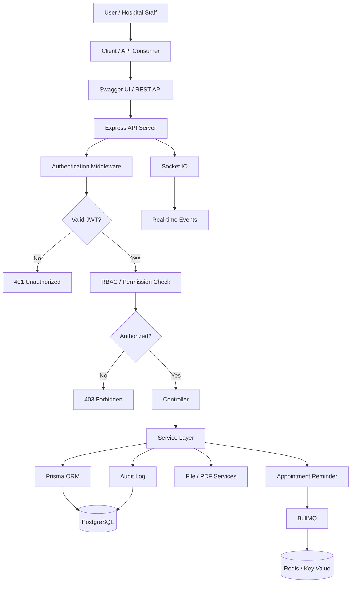

## 2. Production Deployment Architecture

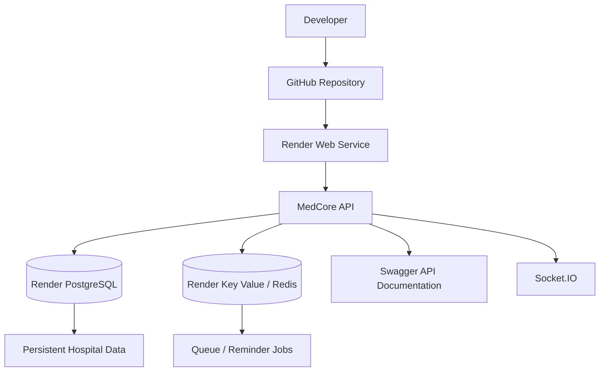

### Production Stack

```text
GitHub
   ↓
Render Web Service
   ↓
MedCore Express + TypeScript API
   ├── PostgreSQL
   ├── Redis / Key Value
   ├── Socket.IO
   └── Swagger UI
```

## 3. Complete Hospital Ecosystem

```mermaid
flowchart TD
    A[MedCore Hospital Platform]
    A --> B[Authentication and Security]
    A --> C[Hospital Management]
    A --> D[Patient Management]
    A --> E[Clinical Care]
    A --> F[IPD Management]
    A --> G[Pharmacy]
    A --> H[Diagnostics]
    A --> I[Procedures]
    A --> J[Billing and Payments]
    A --> K[Audit and Monitoring]
    A --> L[Notifications and Background Jobs]

    B --> B1[Register]
    B --> B2[Login]
    B --> B3[JWT Access Token]
    B --> B4[Refresh Token]
    B --> B5[Change Password]
    B --> B6[Forgot / Reset Password]
    B --> B7[RBAC]
    B --> B8[Roles and Permissions]

    C --> C1[Hospital]
    C --> C2[Department]
    C --> C3[Specialization]
    C --> C4[Ward]
    C --> C5[Room]
    C --> C6[Bed]
    C --> C7[Doctor Hospital Assignment]
    C --> C8[Doctor Department Assignment]

    D --> D1[Patient]
    D --> D2[Appointment]

    E --> E1[Encounter]
    E --> E2[Vitals]
    E --> E3[Clinical Notes]
    E --> E4[Diagnosis]
    E --> E5[Allergy]
    E --> E6[Medication History]
    E --> E7[Vaccination]
    E --> E8[Family History]
    E --> E9[Treatment Plan]

    F --> F1[Admission]
    F --> F2[Bed Allocation]
    F --> F3[Discharge Summary]

    G --> G1[Medicine]
    G --> G2[Medicine Stock]
    G --> G3[Prescription]
    G --> G4[Medicine Dispense]

    H --> H1[Diagnostic Test]
    H --> H2[Diagnostic Order]
    H --> H3[Lab Result]
    H --> H4[Imaging Report]

    I --> I1[Procedure]
    I --> I2[Hospital Procedure]
    I --> I3[Procedure Order]
    I --> I4[Procedure Staff Assignment]

    J --> J1[Billing]
    J --> J2[Payment]

    K --> K1[Audit Logs]

    L --> L1[Appointment Reminder]
    L --> L2[BullMQ]
    L --> L3[Redis]
    L --> L4[Socket.IO]
```

## 4. Patient Care Journey

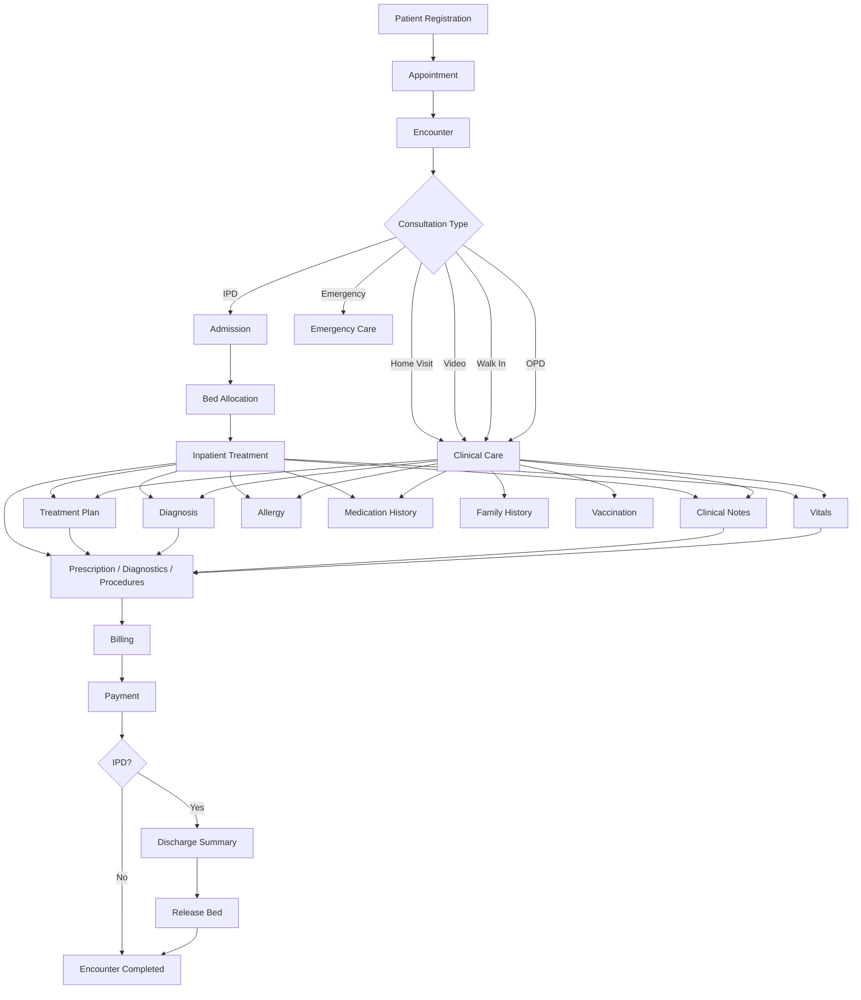

## 5. OPD Flow

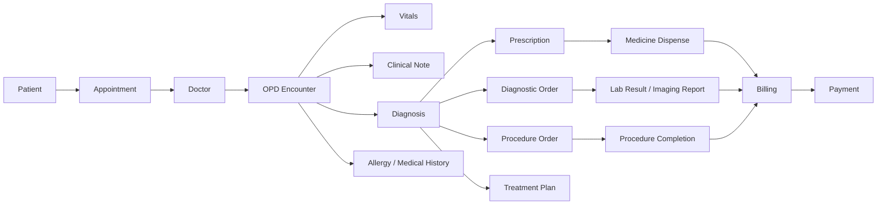

## 6. IPD Flow

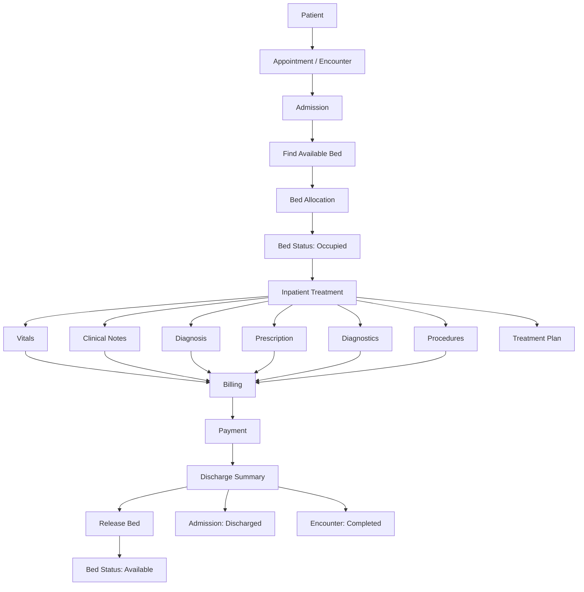

## 7. Authentication and RBAC Flow

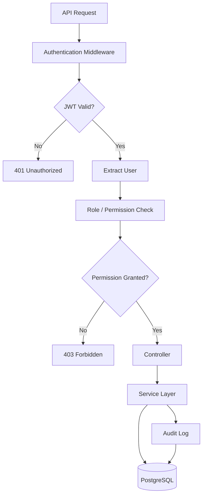

## 8. Appointment Reminder and Background Job Flow

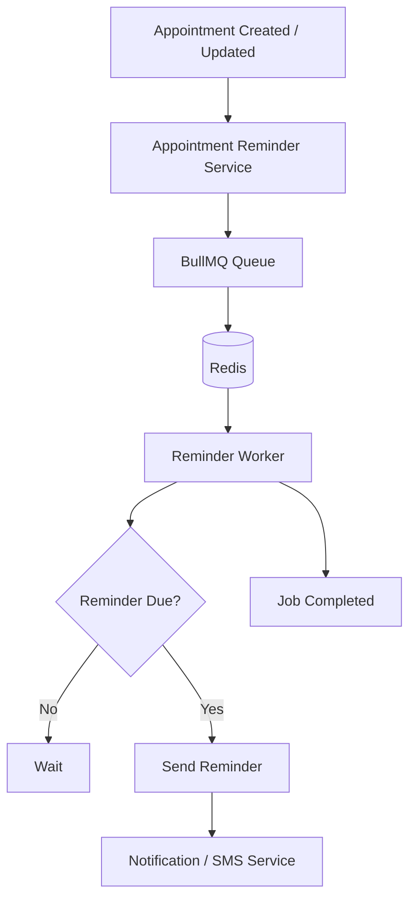

## 9. Real-Time Communication Flow

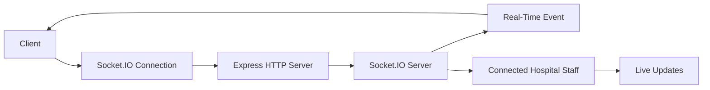

## 10. Nearest Hospital and Bed Availability

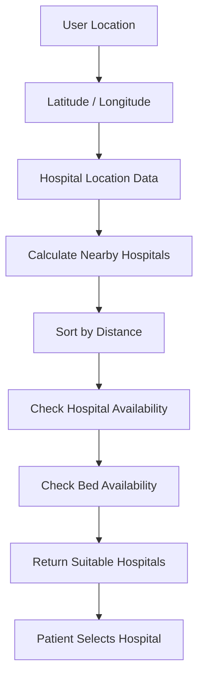

## 11. Prescription and PDF Flow

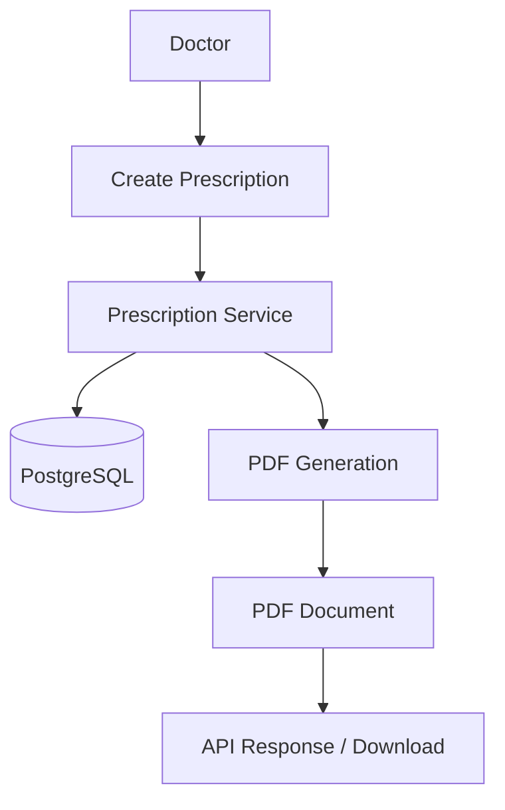

## 12. Audit Logging Flow

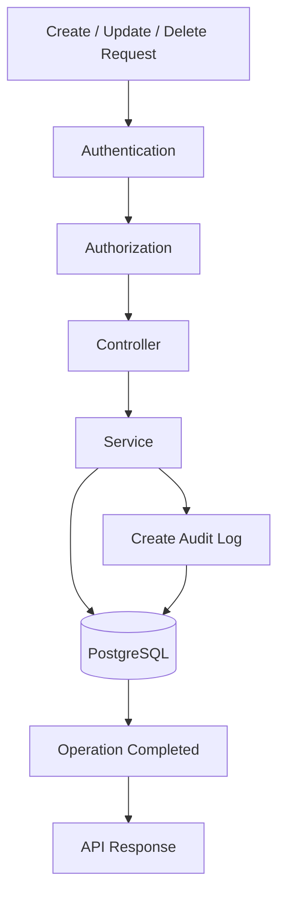

## 13. Main Backend Data Flow

```text
HTTP Request
     ↓
Express Route
     ↓
Authentication
     ↓
RBAC / Permission
     ↓
Controller
     ↓
Service
     ↓
Prisma ORM
     ↓
PostgreSQL
     ↓
API Response

For important mutations:

Service
     ↓
Audit Log
     ↓
PostgreSQL

For background jobs:

Service
     ↓
BullMQ
     ↓
Redis
     ↓
Reminder Worker

For real-time communication:

Express
     ↓
Socket.IO
     ↓
Connected Clients
```

## 14. Complete Technology Architecture

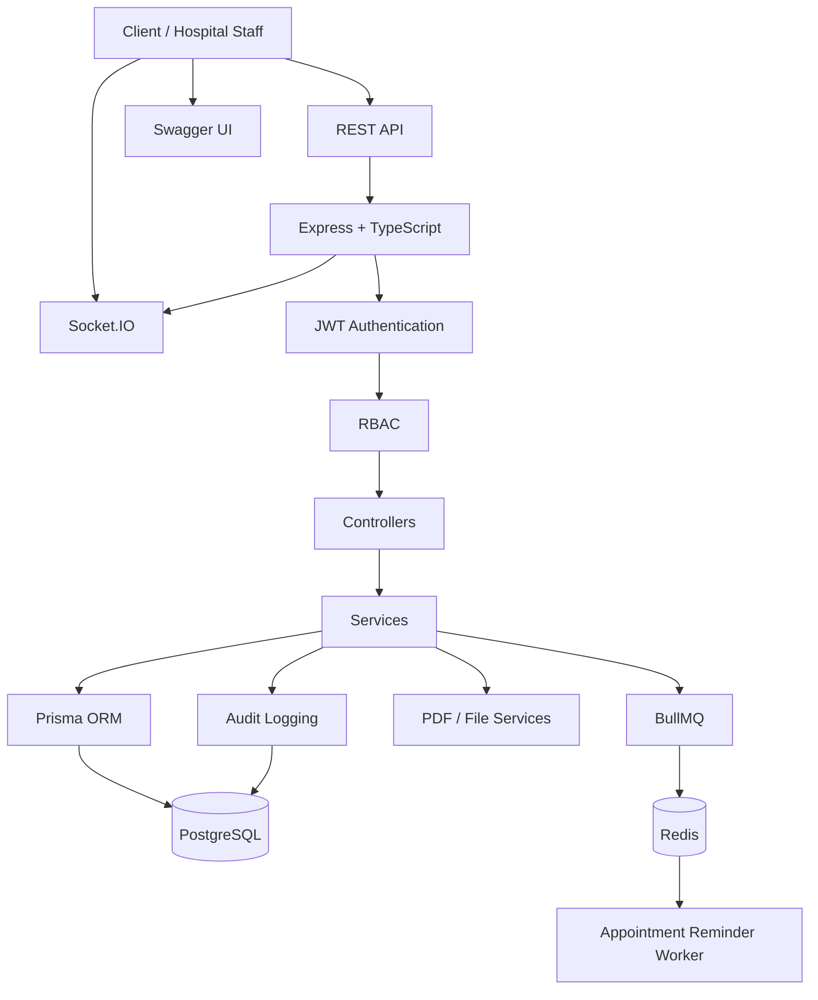

## Module Coverage

### Authentication and Access
- Auth
- Role
- Permission
- Role Permission
- User Role
- Audit Log

### Hospital Infrastructure
- Hospital
- Department
- Specialization
- Ward
- Room
- Bed
- Bed Allocation
- Doctor Hospital
- Doctor Department Assignment

### Patient and Clinical Care
- Patient
- Appointment
- Encounter
- Vitals
- Clinical Note
- Diagnosis
- Allergy
- Medication History
- Vaccination
- Family History
- Treatment Plan

### IPD
- Admission
- Bed Allocation
- Discharge Summary

### Pharmacy
- Medicine
- Medicine Stock
- Prescription
- Medicine Dispense

### Diagnostics
- Diagnostic Test
- Diagnostic Order
- Lab Result
- Imaging Report

### Procedures
- Procedure
- Hospital Procedure
- Procedure Order
- Procedure Staff Assignment

### Finance
- Billing
- Payment

### Infrastructure and Services
- PostgreSQL
- Prisma ORM
- Redis / Key Value
- BullMQ
- Socket.IO
- Swagger
- PDF Generation
- File Uploads
- JWT / RBAC
- Audit Logging

## Production Deployment

```text
Developer
    ↓
GitHub
    ↓
Render Web Service
    ↓
MedCore Hospital API
    ├── Express + TypeScript
    ├── Prisma
    ├── JWT / RBAC
    ├── Swagger
    ├── Socket.IO
    ├── PDF / File Services
    └── Appointment Reminder Worker
            │
            ├── BullMQ
            └── Redis / Key Value

MedCore API
    ↓
Render PostgreSQL
    ↓
Hospital Management Data
```

> This document represents the implemented architecture, major business workflows, backend data flow, background processing, real-time communication, and production deployment structure of the MedCore Hospital Management Platform.
