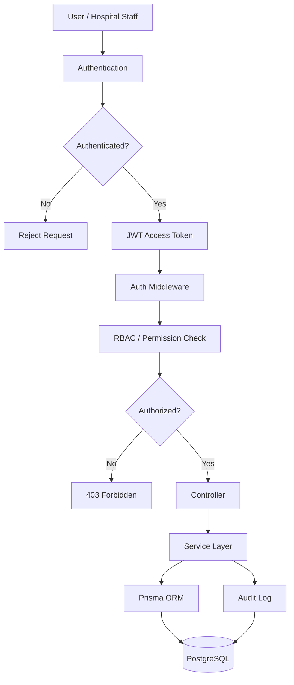
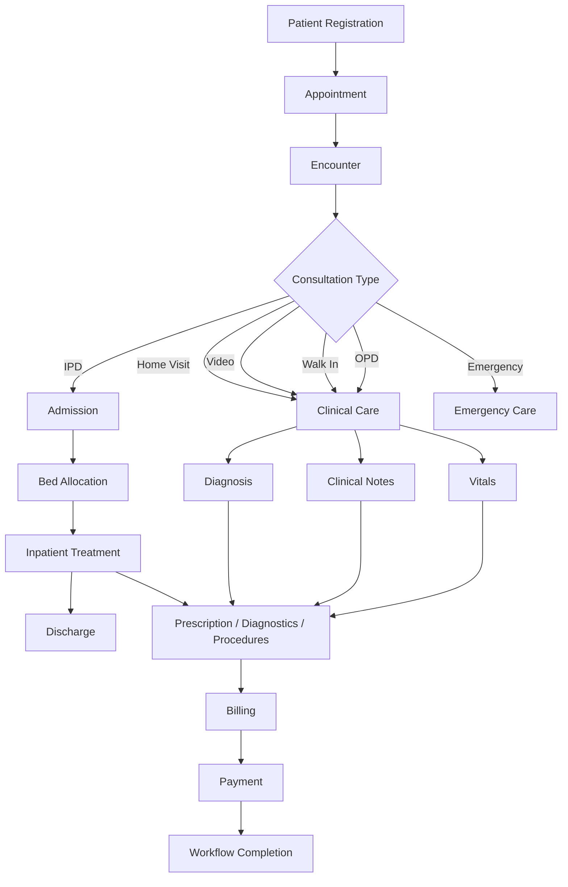
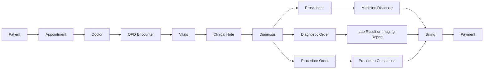
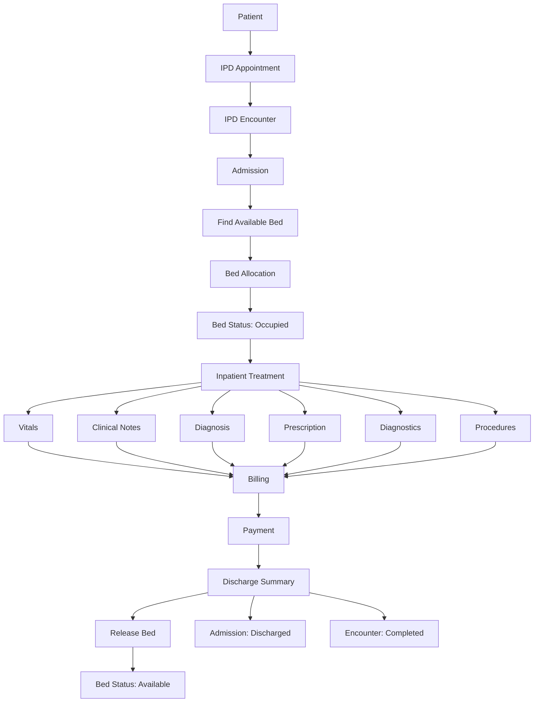
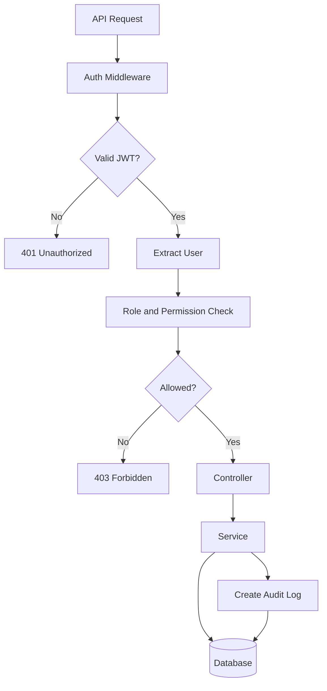
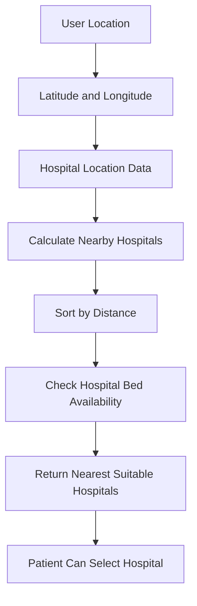

# MedCore Hospital Management Platform – Complete System Flow Chart

## 1. High-Level Platform Flow



---

## 2. Complete Hospital Ecosystem Flow

```mermaid
flowchart TD
    A[MedCore Hospital Platform]

    A --> B[Auth and Security]
    A --> C[Hospital Management]
    A --> D[Patient Management]
    A --> E[Clinical Care]
    A --> F[IPD Management]
    A --> G[Pharmacy]
    A --> H[Diagnostics]
    A --> I[Procedures]
    A --> J[Billing and Payments]
    A --> K[Audit and Monitoring]

    B --> B1[Register and Login]
    B --> B2[Access Token]
    B --> B3[Refresh Token]
    B --> B4[Change Password]
    B --> B5[Forgot and Reset Password]
    B --> B6[RBAC]

    C --> C1[Hospital]
    C --> C2[Department]
    C --> C3[Ward]
    C --> C4[Room]
    C --> C5[Bed]
    C --> C6[Location and Availability]

    D --> D1[Patient]
    D --> D2[Appointment]

    E --> E1[Encounter]
    E --> E2[Vitals]
    E --> E3[Clinical Notes]
    E --> E4[Diagnosis]

    F --> F1[Admission]
    F --> F2[Bed Allocation]
    F --> F3[Discharge Summary]

    G --> G1[Medicine]
    G --> G2[Medicine Stock]
    G --> G3[Prescription]
    G --> G4[Medicine Dispense]

    H --> H1[Diagnostic Test]
    H --> H2[Diagnostic Order]
    H --> H3[Lab Result]
    H --> H4[Imaging Report]

    I --> I1[Procedure]
    I --> I2[Hospital Procedure]
    I --> I3[Procedure Order]
    I --> I4[Procedure Staff Assignment]

    J --> J1[Billing]
    J --> J2[Payment]
```



---

## 3. Patient Care Journey



---

## 4. OPD Flow



---

## 5. IPD Flow



---

## 6. Security and Audit Flow



---

## 7. Nearest Hospital and Bed Availability Flow



---

## 8. Main Data Layer

```text
HTTP Request
     ↓
Express Route
     ↓
Authentication Middleware
     ↓
Authorization / RBAC
     ↓
Controller
     ↓
Service
     ↓
Prisma ORM
     ↓
PostgreSQL Database
     ↓
Response

Important mutation
     ↓
Audit Log
```

---

## Module Coverage

### Authentication and Access
- Auth
- Role
- Permission
- Role Permission
- User Role
- Audit Log

### Hospital Infrastructure
- Hospital
- Department
- Ward
- Room
- Bed
- Bed Allocation
- Doctor Hospital
- Doctor Department Assignment
- Specialization

### Patient and Clinical Care
- Patient
- Appointment
- Encounter
- Vitals
- Clinical Note
- Diagnosis

### IPD
- Admission
- Bed Allocation
- Discharge Summary

### Pharmacy
- Medicine
- Medicine Stock
- Prescription
- Medicine Dispense

### Diagnostics
- Diagnostic Test
- Diagnostic Order
- Lab Result
- Imaging Report

### Procedures
- Procedure
- Hospital Procedure
- Procedure Order
- Procedure Staff Assignment

### Finance
- Billing
- Payment

---

> This document describes the high-level implemented architecture and major workflow relationships of the MedCore Hospital Management Platform.
